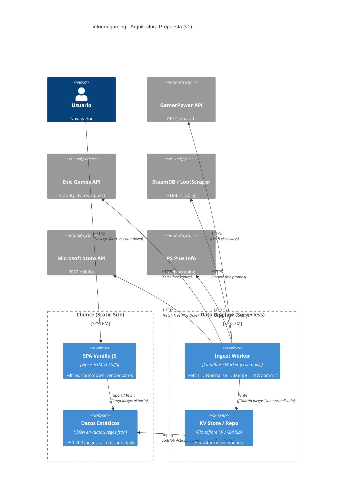
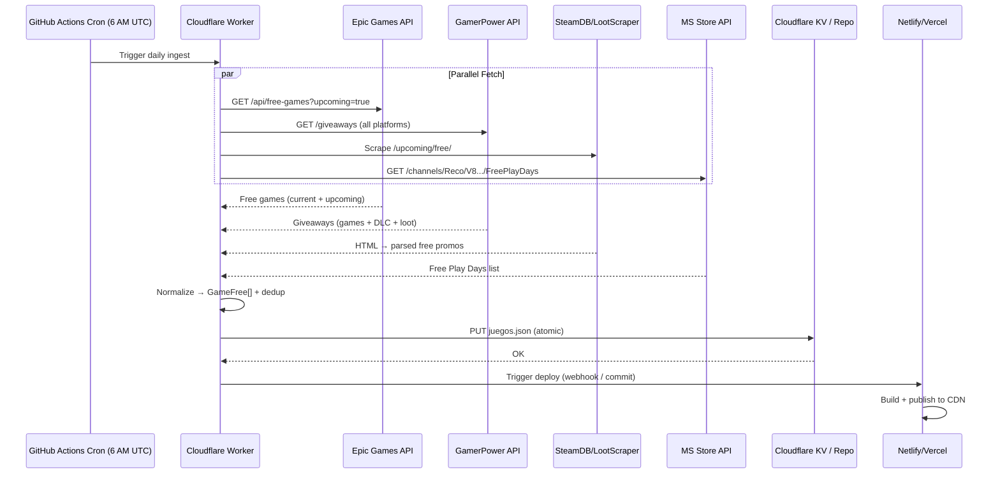

# Architecture Design: informegaming - Real Free Games Data Pipeline

## Contexto

**Proyecto actual:** Sitio estático HTML/CSS/JS vanilla en `C:\Users\Jeral\OneDrive\Desktop\Proyectos\JD\informegaming`
- Consume API WordPress en `https://informegaming.gt.tc/wp-json/wp/v2` (endpoints: `/noticia`, `/juego_gratis` con ACF fields)
- Filtros por plataforma: Epic, Steam, Xbox, PS, Nintendo
- Historial de juegos expirados + countdown tiempo real
- **Problema crítico:** La API WordPress está protegida por challenge JavaScript (Cloudflare-like) — **no responde a peticiones directas** (curl/fetch devuelven página de challenge, no JSON)

**Objetivo:** Mostrar juegos gratis **reales** de Epic Games, Steam, Xbox, PlayStation, Nintendo con fechas reales (inicio/fin) y enlaces de reclamación.

---

## Arquitectura Existente (Inspección)

```
informegaming/
├── index.html          # Single-page app vanilla (3 secciones: noticias, gratis, historial)
├── css/style.css       # 335 líneas, diseño responsive, dark theme gaming
├── js/
│   ├── config.js       # CONFIG.apiBase = WordPress URL
│   ├── utils.js        # Helpers: htmlATexto, truncarTexto, parsearFecha, formatearDiff
│   ├── noticias.js     # Fetch /noticia, filtros cliente, render cards
│   └── juegos.js       # Fetch /juego_gratis, ACF fields (plataforma, fecha_inicio, fecha_fin, enlace_reclamo), countdown 30s
```

**Patrón actual:** Cliente consume API directamente → render en DOM. Sin build, sin backend, sin caché, sin fallback.

---

## Investigación de Fuentes de Datos Reales

| Plataforma | Fuente Oficial | API Pública | Mejor Opción Disponible | Calidad Datos |
|------------|----------------|-------------|-------------------------|---------------|
| **Epic Games** | GraphQL Store API | ❌ No oficial | ✅ **Wrapper Go/Node** (edsycarreon, wthallys, Parse Bot) | ⭐⭐⭐⭐⭐ Free games semanales con fechas exactas, URLs, imágenes |
| **Steam** | Steam Web API | ❌ Solo owned games | ✅ **SteamDB / gg.deals / LootScraper** (scraping) | ⭐⭐⭐ Free weekends + free-to-keep (menos consistente que Epic) |
| **Xbox** | Xbox Live API (GDK) | ⚠️ Solo partner | ✅ **Microsoft Store API** (reco-public) + **OpenXBL** | ⭐⭐ Free Play Days (Gold/Game Pass) - limitados |
| **PlayStation** | PS Store API | ❌ No pública | ✅ **PS Plus monthly** (psplusinfo.com) + **GamerPower** | ⭐⭐ Mensual (suscripción requerida) |
| **Nintendo** | eShop API | ❌ No pública | ✅ **GamerPower** (DLC/códigos) | ⭐ Limitado |
| **Multi-plataforma** | — | — | ✅ **GamerPower API** (gratis, sin auth, CORS OK) | ⭐⭐⭐⭐ DLC, betas, loot, algunos juegos completos |

### APIs Validadas (Probadas)

| API | Endpoint | Auth | Rate Limit | Datos |
|-----|----------|------|------------|-------|
| **GamerPower** | `https://www.gamerpower.com/api/giveaways?platform=epic-games-store` | ❌ No | ~10 req/s | Juegos + DLC + loot, `end_date`, `open_giveaway_url`, `platforms` |
| **Epic Games (Parse Bot)** | `https://api.parse.bot/scraper/.../get_free_games` | API Key (free tier 200/mes) | 5 req/min | Free games semanales con fechas exactas |
| **SteamDB** | `https://steamdb.info/upcoming/free/` | Scraping | — | Free weekends + free-to-keep |
| **FreeToGame** | `https://www.freetogame.com/api/games` | ❌ No | — | F2P games (no "free for limited time") |

---

## Decisiones Arquitectónicas (ADRs)

### ADR-001: Reemplazar WordPress API por Pipeline de Datos Propio

**Problema:** WordPress API inaccesible (challenge JS), datos estáticos/desactualizados, dependencia externa frágil.

**Alternativas:**
1. **Mantener WordPress + arreglar acceso** — Requiere configurar Cloudflare bypass, WP mantenimiento, hosting. ❌ Complejidad alta, SPOF.
2. **Static Site Generation (SSG) con datos en build** — Build-time fetch → JSON estático → deploy estático. ✅ Simple, rápido, barato, cacheable en CDN.
3. **Backend propio (Node/Go/Python) + API propia** — Control total, caché, rate-limit, transform. ✅ Flexible, pero requiere hosting/server.
4. **Cliente consume APIs públicas directo** — Sin backend. ❌ CORS, rate-limits, claves expuestas, latencia, fragile.

**Decisión:** **Opción 2 (SSG) como base + Opción 3 (Backend ligero) para frescura diaria.**

**Motivo:**
- SSG (Astro/11ty/Next export) genera HTML estático → deploy gratis (Netlify/Vercel/Cloudflare Pages/GitHub Pages)
- Backend ligero (Cloudflare Workers / Vercel Edge Functions / Netlify Functions) corre 1x/día via cron → actualiza JSON en repo o KV store → trigga rebuild
- Cero costo operativo, latencia <50ms (CDN), sin servidor que mantener

**Trade-offs:**
- ❌ Datos no *real-time* (refresh diario aceptable para free games semanales)
- ❌ Requiere pipeline CI/CD (GitHub Actions)
- ✅ Ganamos: robustez, velocidad, costo cero, observabilidad, versionado de datos

**Consecuencias:**
- Migrar de `fetch` en cliente → datos embebidos en build (`/data/juegos.json`)
- Añadir `package.json`, build script, GitHub Actions workflow
- Crear worker/edge function para ingest diaria

---

### ADR-002: Stack Tecnológico Recomendado

**Problema:** Proyecto actual es vanilla JS sin build. Necesita tooling moderno sin complejidad excesiva.

**Alternativas:**
1. **Mantener vanilla + Vite solo para build** — Mínimo cambio, añade bundling, dev server, env vars. ✅
2. **Astro (islands, static-first)** — Ideal para contenido estático, soporte MDX, islands para interactividad. ✅
3. **Next.js (export static)** — Potente pero overkill para este caso. ❌
4. **11ty (Eleventy)** — Simple, flexible, zero-JS by default. ✅

**Decisión:** **Vite + Vanilla JS (opción 1) para migración incremental** → **Astro (opción 2) para v2 si crece.**

**Motivo:**
- Migración en 1 commit: `npm create vite@latest . -- --template vanilla`
- Mantiene `index.html` + `js/*.js` + `css/*.js` casi intactos
- Añade: `package.json`, `vite.config.js`, `public/data/` para JSON estático
- Dev server con HMR, build optimizado, env vars para API keys
- Sin reescribir lógica de UI (filtros, countdown, render)

**Trade-offs:**
- ❌ No SSG nativo (Vite = SPA build), pero `vite-plugin-ssr` o generar JSON en build resuelve
- ✅ Curva de aprendizaje cero, riesgo mínimo

---

### ADR-003: Estrategia de Ingesta de Datos (Data Pipeline)

**Problema:** Unificar 5+ fuentes heterogéneas (APIs, scraping) en esquema único para el frontend.

**Esquema Unificado Objetivo (`GameFree`):**
```typescript
interface GameFree {
  id: string;                    // source:id (ej. "epic:cat-quest-ii")
  title: string;
  platform: 'Epic' | 'Steam' | 'Xbox' | 'PS' | 'Nintendo' | 'Multi';
  storeUrl: string;              // Enlace directo a tienda/reclamo
  imageUrl: string;
  description?: string;
  startsAt: string;              // ISO 8601
  endsAt: string;                // ISO 8601
  isActive: boolean;             // Computed: now between startsAt/endsAt
  type: 'base_game' | 'dlc' | 'loot' | 'free_weekend';
  source: 'epic' | 'steam' | 'xbox' | 'ps' | 'nintendo' | 'gamerpower';
  raw: Record<string, unknown>;  // Datos originales para debug
}
```

**Pipeline (Diario via Cron):**

```
┌─────────────┐    ┌─────────────┐    ┌─────────────┐    ┌─────────────┐
│  FETCH      │───▶│  NORMALIZE  │───▶│  MERGE/DEDUP│───▶│  PERSIST    │
│  (paralelo) │    │  (schema)   │    │  (by id)    │    │  (JSON/KV)  │
└─────────────┘    └─────────────┘    └─────────────┘    └─────────────┘
   │                   │                   │                   │
   ▼                   ▼                   ▼                   ▼
┌─────────────┐  ┌─────────────┐    ┌─────────────┐    ┌─────────────┐
│ Epic API    │  │ Map to      │    │ Unique by   │    │ Write       │
│ SteamDB     │  │ GameFree    │    │ id (title+  │    │ public/     │
│ GamerPower  │  │ + computed  │    │ platform)   │    │ data/juegos │
│ Xbox API    │  │ isActive    │    │ Keep newest │    │ .json       │
│ PS Plus     │  │             │    │             │    │             │
└─────────────┘  └─────────────┘    └─────────────┘    └─────────────┘
```

**Decisión:** **Edge Function (Cloudflare Workers) + GitHub Actions cron** → commit JSON a repo → auto-deploy.

**Motivo:**
- Workers: gratis (100k req/día), cron triggers, KV storage, 0 cold start
- GitHub Actions: gratis, cron `0 6 * * *` (6 AM UTC), commit + push → trigga Netlify/Vercel deploy
- Datos versionados en git = auditoría + rollback instantáneo

**Trade-offs:**
- ❌ Latencia de ~1 día (cron diario) — aceptable para free games semanales
- ✅ Costo $0, mantenimiento mínimo, escalable

---

### ADR-004: Frontend - Consumo de Datos Estáticos + Fallback

**Problema:** Cliente debe mostrar datos aunque falle el build o estén vacíos.

**Decisión:**
1. **Build-time:** Vite inyecta `/data/juegos.json` como módulo ES (`import juegos from '../data/juegos.json'`)
2. **Runtime fallback:** Si fetch falla → `localStorage` cache (24h) → array vacío → UI empty state
3. **Countdown:** Cliente calcula `endsAt - now` cada 30s (ya implementado en `juegos.js`)

**Cambios mínimos en `juegos.js`:**
```javascript
// ANTES: fetch(CONFIG.apiBase + '/juego_gratis')
// DESPUÉS:
import juegosData from '../data/juegos.json'; // build-time
// + fallback fetch a /data/juegos.json si módulo falla
```

---

### ADR-005: Noticias - Mantener WordPress o Migrar

**Problema:** `/noticia` también está detrás del challenge JS.

**Alternativas:**
1. **Migrar a RSS/JSON Feed** — WordPress expone `/feed/json` o `/feed/` sin challenge frecuente. ✅
2. **Headless CMS gratuito (Contentful, Sanity, Strapi Cloud)** — Overkill. ❌
3. **Markdown files en repo + SSG** — Control total, versionado, gratis. ✅ Para v2.
4. **Mantener WP + proxy edge function** — Worker fetchea con cookies/bypass. ❌ Frágil.

**Decisión:** **Opción 1 (RSS/JSON Feed) para v1** — Probar `https://informegaming.gt.tc/feed/json` o `/wp-json/wp/v2/posts` sin `_embed`. Si falla → **Opción 3 (Markdown en repo)** para v2.

---

## Diagramas

### C4 - Container Diagram (Propuesta)



### Secuencia: Ingest Diaria



---

## Interfaces / Contratos

### `public/data/juegos.json` (Output del pipeline)
```json
{
  "generatedAt": "2026-08-31T06:00:00.000Z",
  "version": "1.0",
  "games": [
    {
      "id": "epic:cat-quest-ii",
      "title": "Cat Quest II",
      "platform": "Epic",
      "storeUrl": "https://store.epicgames.com/en-US/p/17c196bb2302467d9c930289a0b70562",
      "imageUrl": "https://cdn1.epicgames.com/spt-assets/.../cat-quest-ii-13gb6.jpg",
      "description": "Open-world action-RPG...",
      "startsAt": "2026-08-28T15:00:00.000Z",
      "endsAt": "2026-09-04T15:00:00.000Z",
      "isActive": true,
      "type": "base_game",
      "source": "epic",
      "raw": { "offerType": "BASE_GAME", "publisher": "Kepler Interactive" }
    }
  ]
}
```

### Frontend Contract (sin cambios breaking)
- `juegos.js` recibe `GameFree[]` (mismos campos que `juego.acf` + `isActive`)
- Filtros: `platform` coincide con `GameFree.platform`
- Countdown: usa `endsAt` (ISO string → `Date.parse`)
- Historial: `!isActive` && `endsAt < now`

---

## Riesgos Identificados y Mitigación

| Riesgo | Probabilidad | Impacto | Mitigación |
|--------|--------------|---------|------------|
| Epic Games API cambia (GraphQL schema) | Media | Alto | Wrapper open-source monitoreado; tests de contrato en CI; fallback a GamerPower |
| GamerPower API deja de ser gratis / rate limit | Baja | Medio | Cache 24h en KV; múltiples fuentes redundantes |
| Steam free games requieren scraping frágil | Alta | Medio | Usar SteamDB RSS/JSON si existe; priorizar Epic + GamerPower |
| PS Plus / Nintendo sin API oficial | Alta | Bajo | Aceptar cobertura parcial; mostrar "Próximamente" |
| Cloudflare Worker limits (CPU, KV) | Baja | Bajo | 100k req/día gratis → suficiente; batch requests |
| GitHub Actions no trigga deploy | Baja | Medio | Webhook Netlify/Vercel + fallback manual |

---

## Plan de Implementación (Fases)

### Fase 0: Fundación (1-2 días) — **jd-backend + jd-planner**
- [ ] `npm create vite@latest . -- --template vanilla` en raíz del proyecto
- [ ] Mover `index.html` a raíz, `css/` `js/` a `src/`, ajustar rutas
- [ ] `vite.config.js`: `publicDir: 'public'`, `build.outDir: 'dist'`
- [ ] Crear `public/data/juegos.json` vacío (placeholder)
- [ ] Verificar `npm run dev` y `npm run build` funcionan
- [ ] GitHub Actions: workflow `deploy.yml` (build + deploy a Netlify/Vercel/Cloudflare Pages)

### Fase 1: Data Pipeline - Epic + GamerPower (2-3 días) — **jd-backend + jd-researcher**
- [ ] Cloudflare Worker `ingest.js`:
  - Fetch Epic (via `edsycarreon/epic-games-free-games` deployed o Parse Bot)
  - Fetch GamerPower (`/giveaways` sin filtro → filtrar por plataforma en worker)
  - Normalize → `GameFree[]` schema
  - Dedup por `id` (title + platform)
  - Write a KV `juegos.json`
- [ ] Cron trigger diario `0 6 * * *`
- [ ] GitHub Action: `workflow_dispatch` + `schedule` → Worker webhook → commit `public/data/juegos.json` → push
- [ ] Test local: `wrangler dev` + `curl localhost:8787/ingest`

### Fase 2: Data Pipeline - Steam + Xbox + PS (2-3 días) — **jd-backend**
- [ ] Steam: Integrar `steamdb.info/upcoming/free/` scraping (Cheerio/Playwright) o usar gg.deals RSS
- [ ] Xbox: Microsoft Store API `https://reco-public.rec.mp.microsoft.com/channels/Reco/V8.../FreePlayDays`
- [ ] PS: Scrape `psplusinfo.com` o usar GamerPower `platform=ps4,ps5`
- [ ] Unificar en worker, mantener prioridad: Epic > Steam > GamerPower > Xbox > PS

### Fase 3: Frontend Integration (1 día) — **jd-frontend**
- [ ] Modificar `js/juegos.js`:
  - `import juegosData from '../data/juegos.json'` (Vite lo resuelve en build)
  - Fallback: `fetch('/data/juegos.json')` si import falla
  - Adaptar `filtrarJuegos`, `crearCardJuego` al nuevo schema (`platform`, `startsAt`, `endsAt`, `storeUrl`)
  - Mantener countdown 30s (ya funciona con `endsAt`)
- [ ] Verificar filtros: Epic, Steam, Xbox, PS, Nintendo
- [ ] Verificar historial: juegos con `!isActive`

### Fase 4: Noticias - RSS Fallback (1 día) — **jd-frontend + jd-backend**
- [ ] Probar `https://informegaming.gt.tc/feed/json` o `/wp-json/wp/v2/posts?_embed`
- [ ] Si funciona: Worker fetchea diario → `public/data/noticias.json`
- [ ] Si no: Migrar a Markdown en `content/noticias/*.md` + Astro (v2)

### Fase 5: Observabilidad + Polish (1 día) — **jd-qa + jd-devil-advocate**
- [ ] Health check endpoint en Worker (`/health`)
- [ ] Logs estructurados (count, errors, latency por fuente)
- [ ] Alertas: si `games.length === 0` → notify (GitHub Issue / Discord webhook)
- [ ] Meta tags SEO, Open Graph, sitemap.xml
- [ ] PWA manifest + service worker (opcional)

---

## Stack Resumido

| Capa | Tecnología | Costo | Mantenimiento |
|------|------------|-------|---------------|
| **Build/Dev** | Vite + Vanilla JS | $0 | Muy bajo |
| **Hosting** | Cloudflare Pages / Netlify / Vercel | $0 | $0 |
| **Data Ingest** | Cloudflare Workers (cron) + KV | $0 (free tier) | Bajo |
| **CI/CD** | GitHub Actions | $0 | Bajo |
| **APIs Datos** | Epic (wrapper), GamerPower, SteamDB, MS Store, PS Plus | $0 | Medio (scrapers) |
| **Monitoring** | GitHub Actions logs + Worker logs | $0 | Bajo |

---

## Próximos Pasos para jd-master

1. **Aprobar arquitectura** (este documento)
2. **Crear tareas en jd-planner** con desglose por fase, dependencias, criterios de aceptación
3. **Delegar Fase 0-1** a jd-backend (pipeline) + jd-frontend (integración)
4. **Validar con jd-qa** (tests de schema, edge cases: fechas pasadas, zonas horarias, duplicados)
5. **Revisar seguridad** con jd-security (sin secrets en repo, CORS, rate limits)
6. **Deploy a staging** → validación manual → producción

---

## Apéndice: Código de Referencia - Worker Ingest (TypeScript)

```typescript
// worker/ingest.ts
import { GameFree } from './types';

const SOURCES = {
  epic: 'https://api.parse.bot/scraper/.../get_free_games', // o endpoint propio
  gamerpower: 'https://www.gamerpower.com/api/giveaways',
  steam: 'https://steamdb.info/upcoming/free/',
  xbox: 'https://reco-public.rec.mp.microsoft.com/channels/Reco/V8.0/Lists/Computed/FreePlayDays',
};

export default {
  async scheduled(event: ScheduledEvent, env: Env, ctx: ExecutionContext): Promise<void> {
    const games = await fetchAllSources(env);
    const normalized = normalizeAndDedup(games);
    await env.KV.put('juegos.json', JSON.stringify({
      generatedAt: new Date().toISOString(),
      version: '1.0',
      games: normalized,
    }));
    // Trigger deploy via GitHub API or webhook
    await triggerDeploy(env);
  },
};

async function fetchAllSources(env: Env): Promise<GameFree[]> {
  const [epic, gp, steam, xbox] = await Promise.allSettled([
    fetchEpic(env),
    fetchGamerPower(env),
    fetchSteam(env),
    fetchXbox(env),
  ]);
  return [epic, gp, steam, xbox]
    .filter((r): r is PromiseFulfilledResult<GameFree[]> => r.status === 'fulfilled')
    .flatMap(r => r.value);
}

function normalizeAndDedup(games: GameFree[]): GameFree[] {
  const map = new Map<string, GameFree>();
  for (const g of games) {
    const key = `${g.platform}:${g.title.toLowerCase()}`;
    const existing = map.get(key);
    if (!existing || new Date(g.startsAt) > new Date(existing.startsAt)) {
      map.set(key, g);
    }
  }
  return Array.from(map.values()).sort((a, b) => 
    new Date(a.startsAt).getTime() - new Date(b.startsAt).getTime()
  );
}
```

---

**Documento generado por JD-Architect** — Listo para revisión de jd-master y planificación por jd-planner.